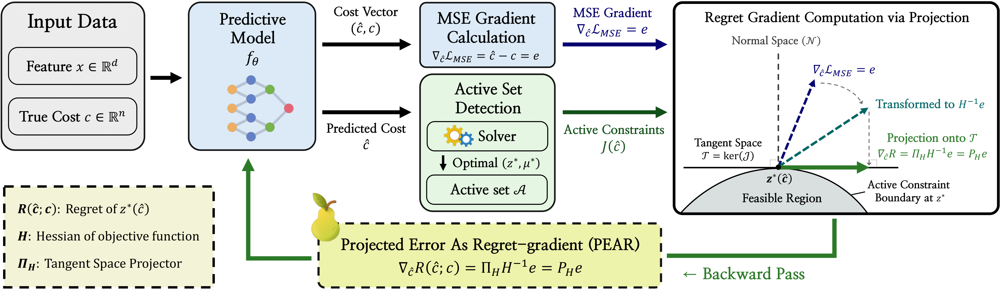

# 🍐PEAR: Projected Error As Regret-gradient

Official implementation for [Decision-Focused Learning via Tangent-Space Projection of Prediction Error](https://arxiv.org/abs/2605.01361)

<p align="center">
  <a href="image/main_figure.pdf">
    
  </a>
</p>

## Setup

```bash
pip install -r requirements.txt
cd pkg && pip install -e .
```

Requires Gurobi with a valid license.

## Project Structure

```
├── projection/              # Core library
│   ├── training/            # Trainers (MSE, SPO+, DBB, PFYL, Projection, LAVA)
│   └── models/              # Network architectures
├── experiments/
│   ├── lp/                  # LP experiments (Shortest Path, Knapsack)
│   ├── qp/                  # QP experiments (Mean-Variance Optimization)
│   └── constraint_shift/    # Constraint shift experiments
├── pkg/pyepo/               # Modified PyEPO library
├── scripts/                 # Run scripts
├── analyze/                 # Result analysis scripts
└── figures/                 # Generated figures
```

## Experiments

### 1. LP Benchmarks (Shortest Path, Knapsack)

```bash
# Single run
python -m experiments.lp.run --prob sp --method projection --deg 8 --seed 0
python -m experiments.lp.run --prob ks --method projection --deg 8 --seed 0

# Full experiments (all methods, degrees, seeds)
bash scripts/run_lp.sh
```

**Methods:** `mse`, `spo`, `dbb`, `pfyl`, `lava`, `projection`

### 2. Noise Experiments

```bash
# Single run with noise
python -m experiments.lp.run --prob sp --method projection --deg 8 --noise 0.3 --seed 0

# Full noise experiments
bash scripts/run_noise.sh
```

### 3. Real-world QP Experiments (Mean-Variance Optimization)

```bash
# Single run
python -m experiments.qp.run --method projection --seed 0

# Full experiments
bash scripts/run_mvo.sh

# Evaluation
python -m experiments.qp.eval_portfolio
python -m experiments.qp.eval_regret
```

### 4. Constraint Shift Experiments

```bash
# Capacity generalization (Knapsack)
python -m experiments.constraint_shift.run_capacity_generalization --method projection --seed 0

# Direction generalization (Shortest Path)
python -m experiments.constraint_shift.run_direction_generalization --method projection --seed 0

# Full experiments
bash scripts/run_lp_and_constraint_shift.sh
```

## Results Analysis

```bash
# LP results
python analyze/lp_results.py

# LP results with noise
python analyze/lp_results.py --noise

# MVO results
python analyze/mvo_results.py --all

# Constraint shift results
python analyze/constraint_shift_results.py
```

## Visualization

```bash
python scripts/visualize_lp.py
python scripts/visualize_qp.py
python scripts/visualize_constraint_shift.py
```

## License

MIT


